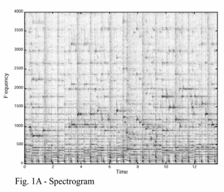
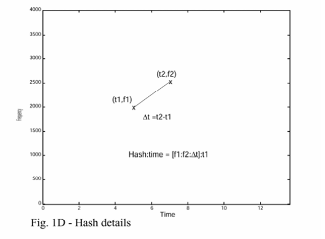
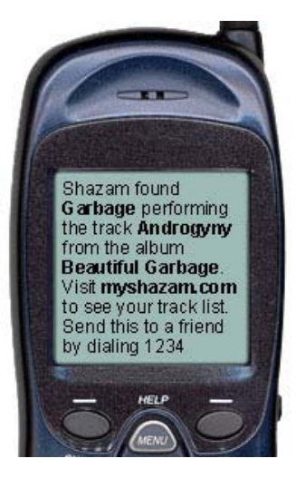

# shazoom

## Disclaimer
This project is intended to replicate the audio fingerprinting algorithm from Shazam as described in Avery Li-Chun Wang's original paper (2003) for educational purposes only. It is not affiliated with or endorsed by Shazam.

Paper: https://www.ee.columbia.edu/~dpwe/papers/Wang03-shazam.pdf

Also in case you're curious, here's the Shazam pitch deck from 2003: https://ismir2003.ismir.net/presentations/Wang.pdf

## Structure of the repo

Main elements:
- `audio_fingerprint.py`: generates an audio fingerprint for a particular song.
- `song_matcher.py`: takes an audio clip's fingerprint and finds closest song in the database.
- `db_pipeline`: used to create initial databse. Fetches 200 songs and their metadata.

All other scripts are for deployment or other logic not specific to Shazam.

## How the Shazam algorithm works

The core problem of Shazam is to identify a song from a short audio clip.

**Representing songs**
Audio clips are particularly challenging to identify due to noise, dropouts, compression (originally clips sent over telephony network with GSM audio codecs), poor speakers/microphones, and clips being randomly sampled from any part of the song.

To overcome this we want to create a fingerprint for each song that is robust to these distortions while also remaining sufficiently entropic.

We choose spectrogram peaks, i.e., the time-frequency pairs with the highest magnitude. For each song we take the top k peaks by magnitude, with k proportional to song duration. A density criterion is also applied to make sure the peaks are uniformly spread throughout the song, namely that there must be no higher peak within a certain distance in the time-frequency domain.

These peaks are the most likely parts of the song to survive the distortions listed above because they are the loudest. 

**Searching and storing**
The second challenge is finding a way to store and search for these fingerprints to help match audio clips to the right song.

Crucially we want our search to be robust to missing peaks due to the distortions listed above, so simply trying to perfectly match an audio clip's fingerprint to the fingerprint of every song in our database until we hit a match will not work. 

To address this, the idea is to break up the fingerprints into components, and then count how many of the components of our audio clip match each of the songs in our database. The song which has the most matches is then the most likely to be the original song for our audio clip. 

Having each peak be one component unfortunately won't work: the audio clips do not necessarily start from the beginning of the song, so the absolute time offset of the peak in the audio clip won't match the offset of the same peak in the song in our database. 

We therefore rely on relative differences between peaks, which are robust to this varying offset. For each peak, we pair it with several of the peaks that follow it, saving each of these pairs in our database. 

We can encode a pair of peaks in a 64-bit struct which makes it an extremely light representation quick to search over. Each peak's frequency (assuming 1024 frequency bins) can be represented with 10-bits, with an additional 10 bits to encode the time difference between the two. In the database itself we then also add an additional 24 bits for track ID (2^24 = max 16M songs in database) and 10 bits for time offset of the first peak in the pair to the song's beginning.

In the paper they include this 10-bit time offset to increase confidence and reduce false positives. However, I haven't implemented it here as I find it redundant: once we've matched each pair of peaks in our audio clip to a pair in our DB, simply seeing which track IDs have the most matches is enough and adding additional song properties like time offset doesn't make a difference (at least for the scale of my DB).

## Notes

I find this paper particularly interesting because of how different and creative the approach is vs the default approach to the problem in today's world of neural nets, scaling laws, and bitter lessons. Whereas now you would have simply trained an embedding model and done some semantic search with a nearest neighbours algorithm, the compute and memory constraints at the time prompted what I find a much more creative approach, with several layers of workarounds and tricks to meet the requirements of a Motorola T19.

